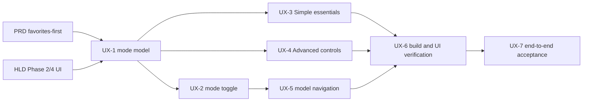

# תוכנית עבודה kuziSlicer — P0 מלא עם תלויות (עדכון 2026-09-05)

**סטטוס:** בעבודה — עדכון לפי מצב בפועל
**מקור:** HLD-3d-slicer-P0.md + PRD-סליסר-3D-מאוחד.md
**תאריך יצירה מקורי:** 2026-09-03
**עדכון אחרון:** 2026-09-05
**שפה:** עברית (ארגון) + אנגלית (משימות קוד)

---

## עדכון ביצוע 2026-09-06 — מסלול שימוש Simple / Advanced

ניתוח הדלתא בין ה-PRD, ה-HLD והקוד העלה שהבסיס הארכיטקטוני והרחבות המדפסות התקדמו משמעותית מעבר לסטטוסים הישנים במסמך, אך דרישת ה-PRD ל-`favorites-first` עם נתיב ברור להגדרות מלאות עדיין לא מומשה כמוצר. ה-slice הבא מקדים שימושיות יומיומית לפני הרחבת מנוע החיתוך:

| מזהה | משימה | תלויה ב | מצב |
|---|---|---|---|
| UX-1 | מודל מצב `simple \| advanced` עם שמירה מקומית | — | ✅ בוצע |
| UX-2 | מתג מצב גלובלי, נגיש וברור | UX-1 | ✅ בוצע |
| UX-3 | Simple מציג רק Model, Printer/Filament ו-Quality | UX-1 | ✅ בוצע |
| UX-4 | Advanced חושף nozzle, import, temperature ו-speed | UX-1 | ✅ בוצע |
| UX-5 | חיבור פעולת Load/Change Model ל-3D Viewer | UX-2 | ✅ בוצע |
| UX-6 | Build + בדיקת UI ידנית בשני המצבים | UX-2..UX-5 | ✅ עבר |
| UX-7 | קבלה: STL → פרופילים → G-code → preview/send | UX-6 | ⚠ pipeline אוטומטי עבר; print אמיתי לא נשלח |
| UX-8 | Simple הוסב לאשף מודרך צעד-אחר-צעד (Model → Printer/Filament → Quality) עם מד-התקדמות ו-Back/Next, לפי כיוון PRD §12/§8 "guided wizards" | UX-3 | ✅ בוצע (`PrintSettings.tsx`); `tsc --noEmit` נקי, בדיקת UI חיה ב-Electron עדיין לביצוע |

החלטת scope: "Simple" הוא מסלול ברירת-המחדל לחיתוך ראשון עם מעט החלטות; "Advanced" אינו מנוע אחר אלא חשיפה של מלוא בקרות הפרופיל והחיתוך. שני המצבים משתמשים באותו state ובאותו pipeline כדי למנוע פיצול התנהגות. תוכנית הבדיקה נשמרת ב-`src/renderer/components/MainWindow.testplan.md`.

---

## תקציר מצב (2026-09-05)

מאז הטיוטה המקורית (2026-09-03) קרו שינויים משמעותיים:

- **§0 נפתר**: הוחלט על **GPL** (שימוש חוזר בקוד Arachne). Phase 1 **פתוח** (unblocked).
- **Phase 0 הושלם כמעט לגמרי** (0.1, 0.1-Host, 0.2, 0.3, 0.4, 0.5, 0.6, 0.7 — כולם ✅).
- **Phase 2 הושלם** (2.1, 2.2, 2.3 — עם הסתייגות על נתוני 2.3, ראה למטה).
- **Phase 3 בוצע אחרת ממה שתוכנן**: במקום Klipper/Moonraker כמתאם ראשון, נבנו בפועל **שני מתאמי מדפסת LAN אמיתיים ומאומתים על חומרה** — Bambu Lab (FTPS+MQTT) ו-Elegoo Centauri Carbon (SDCP v3) — כולל ארכיטקטורת פלאגין חדשה ("rapid printer extension") עם תבנית, test bench בשלוש רמות, ו**הדפסה אמיתית שהוכחה עובדת** על מדפסת Elegoo Centauri Carbon פיזית.
- **⚠️ סיכון ארכיטקטוני חדש שהתגלה**: קיימים **שני מימושים נפרדים** של `arcane-engine` — אחד ב-`kuziSlicer.PluginHost` (C#, GPL, מבודד כתהליך נפרד — התכנון המקורי לפי §0) ואחד ב-`kuziSlicer.extensions` (TypeScript, in-process, נדחף ב-session מקביל). זה דורש החלטה דחופה — ראה "פערים וסיכונים" למטה.
- **Phase 1 לא התחיל בפועל** (מעבר לתשתית arcane-engine הכפולה שהוזכרה).
- **Phase 4/5**: לא טופלו במסגרת התוכנית הזו (תיקוני באגים נקודתיים ב-ModelViewer קרו בנפרד, לא כחלק ממשימות 4.1-4.4 המתוכננות).

כל משימה נושאת:
- **מטרה:** מה ייבנה/יתקבל
- **תלויות:** תנאים מוקדמים
- **סוג בדיקה:** Unit/Integration/Manual
- **סטטוס נוכחי:** ✅ בוצע / ⚠ חלקי / ⏳ לביצוע

---

## Phase 0 — שלד ארכיטקטוני (7 משימות) — ✅ **הושלם**

### Gatekeeping
**§0 – החלטת רישוי** ✅ **נפתר (2026-09-03)**
- **החלטה:** GPL (שימוש חוזר בקוד Arachne).
- **נימוק:** בידוד תהליכי-פלאגין שכבר נבנה ב-Phase 0 (PluginHost מפעיל כל פלאגין כתהליך OS נפרד דרך stdio, לא linking) אומר שה-GPL חל רק על תיקיית הפלאגין של Arachne עצמה — kuziSlicer (Electron) ו-kuziSlicer.PluginHost נשארים Apache-2.0/MIT.
- **⚠️ סיכון חדש שנוצר מאז**: התנאי הזה (בידוד תהליכי) **לא מתקיים** במימוש ה-TypeScript של `arcane-engine` שנדחף ל-`kuziSlicer.extensions` — זה קוד GPL **in-process** באותו Electron process כמו שאר האפליקציה. זה עלול לסתור את כל ההנמקה המשפטית מאחורי §0. **דורש בדיקה משפטית/החלטה לפני שממשיכים לבנות על גבי המימוש הזה.**
- **Phase 1 סטטוס:** ✅ פתוח (unblocked) — אבל המשימות עצמן (1.1-1.5) עדיין לא בוצעו.

### Tasks

#### 0.1 – ממשקי TypeScript גרסתיים לסוגי פלאגינים ✅ **בוצע**
- **קובץ:** `src/types/plugin-*.ts` (manifest, engine, importer, tool) — קיימים, עם `validateManifest`.

#### 0.1-Host – שלד PluginHost (C#/.NET) ✅ **בוצע**
- `dotnet build` → 0 שגיאות; `dotnet test` → 6/6 ירוק.
- **קובץ:** `src/plugins/PluginHost/` (submodule, `kuziSlicer.PluginHost` על GitHub)

#### 0.2 – Sandbox — תהליך OS נפרד + Fault Isolation ✅ **בוצע**
- `PluginProcessAccessor` — spawn per invocation, לא persistent in-process state.

#### 0.3 – Plugin Manager — Load/Unload/Enable/Disable ✅ **בוצע**
- Enable/disable גייט את `invokePlugin`/`streamPlugin`. Hot-unload התברר כלא-רלוונטי: כל invocation מפעיל subprocess חדש, אין state להוריד.
- Self-check: `npm run test:pluginmanager`.

#### 0.4 – פירוק GcodeGenerator ל-Manager + Engine ✅ **בוצע**
- `StlEngine` (parsing טהור) + `GcodeEngine` (מתמטיקה טהורה) + `GcodeGenerator` (אורקסטרציה + PluginHost stub).

#### 0.5 – פירוק ProfilesManager ל-Accessor + Manager ✅ **בוצע**
- `ProfilesAccessor` (I/O בלבד) + `ProfilesManager` (merge/import logic).

#### 0.6 – ניקוי Main.ts — IPC כ-Controller בלבד ✅ **בוצע**
- IPC handlers דקים, לוגיקה בשכבת השירותים.

#### 0.7 – Plugin Host Client ✅ **בוצע**
- `src/main/clients/pluginHostClient.ts` — spawn/kill, REST/SSE/SignalR, retry, health checks.
- **קובץ:** `src/main/services/pluginManager.ts`, `src/main/clients/pluginHostClient.ts`

---

## Phase 2 — מודל הגדרות ופרופילים (3 משימות) — ✅ **הושלם**

#### 2.1 – מדרג Override תלת-שכבתי ✅ **בוצע**
- `src/main/services/engines/overrideEngine.ts` — `resolveOverrides` (part > object > global).
- Self-check: `npm run test:overrideengine`.

#### 2.2 – Config Wizard ✅ **בוצע**
- `App.tsx` מציג `ConfigWizard` (שם/דגם/IP/פורט, Skip) לפני `MainWindow`, מבוסס `settings:get`/`settings:set`.

#### 2.3 – ספריית Manufacturer Profiles ✅ **בוצע, עם הסתייגות**
- 15+ פרופילי מדפסות ב-`src/data/printers.json` (BambuLab, Voron, RatRig, AnkerMake, Anycubic, Creality, Prusa) + **4 וריאנטים של Elegoo Centauri Carbon** (0.2/0.4/0.6/0.8mm, נוסף ב-2026-09-05).
- **⚠️ עדיין פתוח:** רוב הנתונים (טמפ', תאוצה, מהירות) הם ברירות מחדל ציבוריות ידועות, **לא נשלפו ולא אומתו** מול קונפיגורציית קושחה אמיתית (WebFetch נחסם ב-bambulab.com/ratrig.com/ankermake.com). Elegoo Centauri Carbon כן אומת מול חומרה אמיתית.

---

## Phase 3 — שכבת קישוריות (5 משימות) — ⚠ **בוצע חלקית, בכיוון שונה מהתכנון**

**מה שתוכנן:** ממשק מופשט אחד (`IPrinterConnection`) + Klipper/Moonraker כמתאם ראשון + גילוי Bonjour + raw passthrough + נורמליזציית טלמטריה אחידה.

**מה שנבנה בפועל (2026-09-04–05):** שני מתאמים ספציפיים לפרוטוקול, כל אחד עם discovery/telemetry משלו — לא נורמליזציה אחידה חוצת-פרוטוקולים. הסיבה: לא הייתה בהישג יד מדפסת Klipper/Moonraker לבדיקה אמיתית; היו בהישג יד Bambu Lab A1 Mini ו-Elegoo Centauri Carbon.

#### 3.1 – ממשק "חיבור מדפסת" מופשט ⚠ **בוצע אחרת**
- לא נבנה `IPrinterConnection` אחיד כללי. במקום זאת: **`PrinterExtensionPlugin`** — חוזה ל"rapid printer extension" plugins (`discover`/`uploadFile`/`startPrint`/`pausePrint`/`resumePrint`/`cancelPrint`/`getStatus`/`captureSnapshot`), ספציפי לתרחיש "LAN printer, upload+control" ולא כללי כמו התכנון המקורי (לא כולל raw passthrough, לא מתוכנן לזרם וידאו/Klipper).
- **קובץ:** `src/plugins/extensions/plugins/_template-printer-extension/src/printer-extension-contract.ts`
- **סטטוס:** ✅ בשימוש בפועל, מאומת ב-testbench + חומרה אמיתית.

#### 3.2 – מתאם Klipper/Moonraker ⏳ **לא בוצע — הוחלף בפועל**
- **לא נבנה מתאם Klipper/Moonraker.** במקומו:
  - **Bambu Lab** (`src/main/clients/bambuPrinterClient.ts`): FTPS upload (990) + MQTT print command (8883), verified against Bambu Lab A1 Mini אמיתי.
  - **Elegoo Centauri Carbon** (`src/plugins/extensions/plugins/elegoo-centauri-carbon/`): SDCP v3 מלא — discover/upload/print/pause/resume/cancel/status/camera, **מאומת עם הדפסה אמיתית** על 192.168.1.12 (2026-09-05).
- **הערה:** OpenCentauri (מוד קהילתי על הקושחה) נבדק — הוא לא מחליף את SDCP, רק מוסיף גישת SSH/כלים — אז אותו מימוש מכסה קושחה מקורית וגם OpenCentauri.
- **אם Klipper/Moonraker עדיין נדרש ל-P0**: זו משימה פתוחה, לא נגעו בה כלל.

#### 3.3 – גילוי-רשת Bonjour ⏳ **לא בוצע**
- כל מתאם עושה discovery ספציפי-לפרוטוקול (Elegoo: UDP broadcast M99999; Bambu: IP מוזן ידנית). אין שכבת גילוי מאוחדת מבוססת mDNS/Bonjour.

#### 3.4 – Raw G-code Passthrough + Confirmation Gate ⏳ **לא בוצע**

#### 3.5 – נורמליזציית טלמטריה ⚠ **חלקי, לא אחיד חוצה-פרוטוקולים**
- Elegoo: `getStatus()` ממופה ל-`PrinterStatusInfo` (state/temps/layer/progress) — אבל זה טיפוס ספציפי ל-printer-extension plugins, לא מודל אירועים גנרי כמו שתוכנן.
- Bambu: **אין status/progress feedback בכלל** אחרי שההדפסה מתחילה (ידוע, מתועד כפער ב-memory) — רק אישור ש-MQTT command התקבל.

---

## Phase 4 — תצוגה 3D ו-UI בסיסי (4 משימות) — ⏳ **לא טופל תחת התוכנית הזו**

תיקוני באגים אמיתיים קרו ב-`ModelViewer.tsx` (WebGL context fallback, GPU crash fix, 3MF `parseAsync` fix, base-path fix) — **לא חלק ממשימות 4.1-4.4** אלא תיקוני regression נקודתיים שהתגלו תוך כדי בדיקת golden path. משימות 4.1 (PBR rendering)/4.2 (support gizmo)/4.3 (dark mode)/4.4 (multi-bed) **לא התחילו**.

---

## Phase 5 — אריזה וקבלה (3 משימות) — ⏳ **לא טופל**

#### 5.1 – אריזת Starter Extensions ⚠ **קיים חלקית, לא כמתוכנן**
- `arcane-engine`/`overhang-detector`/`profile-importer` **כן קיימים** ב-`kuziSlicer.extensions`, אבל **לא נטענים אוטומטית** ע"י שום loader (אין קוד ב-`src/main`/`src/renderer` שמפנה ל-`kuziSlicer.extensions` בכלל). זה בנוסף לכפילות arcane-engine שהוזכרה למעלה.

#### 5.2 – EULA / Disclaimer ⏳ **לא בוצע**
#### 5.3 – תרחיש קבלה End-to-End ⏳ **לא בוצע** (הרצה ידנית של golden path קרתה, אבל לא כתרחיש E2E אוטומטי כתוב)

---

## Phase 1 — מנוע החיתוך (5 משימות) ❌ **חסום ב-§0**

**תלויות קודמות:** Phase 0 + **החלטת רישוי ב-§0**

  - **תלוי ב-§0:** אם GPL → שימוש חוזר בקוד; אם Apache → יישום עצמאי
- **תלויות:** Phase 0, §0 decision  
- **סטטוס:** ⏳ חסום ב-§0  
- **סטטוס:** ⏳ חסום ב-§0  
- **סטטוס:** ⏳ חסום ב-§0  
- **סטטוס:** ⏳ חסום ב-§0  
- **סטטוס:** ⏳ חסום ב-§0  
---

│ BLOCKING DECISION                                           │
│ §0: Licensing (GPL vs. Apache) — Phase 1 waits             │
| 🔄 | Phase 1 | 0, §0 | **⏸ BLOCKED** | **תלוי בהחלטה §0.** Run parallel to 2–5 ברגע שההחלטה תתקבל |
## פערים וסיכונים — עדכון 2026-09-05

| סיכון | השפעה | סבירות | פעולה מומלצת |
|------|--------|--------|---------|
| **🔴 כפילות arcane-engine (C# מבודד GPL מול TS in-process)** | עלול לפגוע בהנמקה המשפטית של §0 (בידוד GPL); בזבוז עבודה; אי-בהירות איזה מהם "האמיתי" | **גבוהה** | **דחוף**: להחליט איזה מימוש הוא הקנוני, למחוק/לארכב את השני, ולבדוק עם ייעוץ משפטי/בעל המוצר אם קוד GPL בתוך אותו Electron process (גם אם TypeScript, לא native linking) מהווה בעיה |
| Klipper/Moonraker לא נבנה כלל | אם P0 דורש תמיכת Klipper — פער אמיתי, לא רק איחור | בינונית-גבוהה (תלוי אם יש משתמשי Klipper בהישג יד) | להחליט אם נדרש ל-P0 או נדחה ל-P1 |
| מדפסת Elegoo Centauri Carbon נתקעת (network stack) בתגובה ל-payload שגוי | כבר קרה 5 פעמים בפועל, תוקן — אבל מראה שגם payload שנראה תקין (לפי דוקומנטציה קהילתית) יכול להיות שגוי בפועל | נמוכה כעת (תוקן ומאומת) | לפני כל שינוי עתידי ב-`sdcp.ts`, לבדוק קודם מול mock, ולהזהיר לפני בדיקה על חומרה אמיתית |
| Bambu Lab — אין status feedback אחרי start | המשתמש לא יודע אם ההדפסה באמת מתקדמת | בינונית | להוסיף MQTT report-topic subscription |
| נתוני 2.3 (מפרטי יצרנים) לא מאומתים | ערכי טמפ'/תאוצה שגויים עלולים לגרום נזק פיזי בפועל | בינונית | Spot-check מול קונפיג קושחה אמיתי לפני שחרור למשתמשים |
| §0 לא מתקבל לפי לוח הזמנים | P0 מתעכב 1–2 משבועות | בינונית | Track closely, escalate week 2 |

---

## הצעד הבא (עדכון 2026-09-05)

- **Exact PluginHost hosting/CI:** עדיין לא בחרנו GitHub owner/org ו-CI service (GitHub Actions vs. Azure).
בסדר עדיפות מומלץ:

### 1. **§0 — רישוי מנוע החיתוך**
- **אפשרות A:** GPL (שימוש חוזר בקוד Arachne + PrusaSlicer)
  - **עלות:** kuziSlicer.PluginHost binary חייב להיות Apache-2.0, בלי linking ל-GPL plugin; נתונים גיוונים בקוד open-source.
**עם מי:** בעל המוצר.  

3. **לסגור את הפער בין Phase 3 בפועל לתכנון**: אם רוצים שכבת telemetry/discovery אחידה (3.3, 3.5 כמתוכנן), זו עבודת refactor אמיתית מעל שני המתאמים הקיימים — לא רק תיעוד. שווה להחליט אם זה נדרש ל-P0 או נדחה.

4. **Bambu status feedback** — פער ידוע, קל יחסית לסגור (MQTT subscribe לטופיק status).

5. **Spot-check נתוני 2.3** מול קונפיגורציית קושחה אמיתית (BambuLab/RatRig/AnkerMake) לפני שחרור — סיכון בטיחותי אמיתי (טמפ'/תאוצה שגויים).

6. **Phase 1 kickoff אמיתי** — רק אחרי סעיף 1 למעלה. לבדוק קודם מה בדיוק כבר קיים תחת `PluginHost/plugins/*` (scaffolding בלבד, או מימוש אמיתי?) לפני שמתחילים מ-1.1.

7. **Phase 5.1** — אם `arcane-engine`/`overhang-detector`/`profile-importer` נשארים ב-`kuziSlicer.extensions`, עדיין חסר loader אמיתי שטוען אותם לתוך האפליקציה — כרגע שום דבר לא מפנה לריפו הזה מ-`src/main`/`src/renderer`.

1. **עדכון §0 decision** לפי choice A/B למעלה — משפיע על Phase 1 timeline (תשובה דחופה, דצור לפני שבוע 1).
---

**סטטוס:** בעבודה, לא טיוטה — משקף מצב אמיתי בקוד נכון ל-2026-09-05.
**עדכון אחרון:** 2026-09-05
